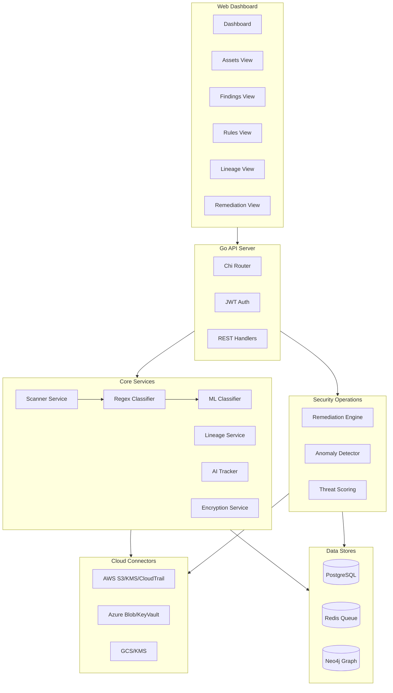

# Building a DSPM from Scratch

A technical deep-dive into building a Data Security Posture Management solution. This document covers the architecture, data flows, and implementation details of discovering, classifying, and protecting sensitive data in cloud environments.

## What is DSPM?

DSPM answers the critical questions every security team needs to know:

| Question | DSPM Capability |
|----------|-----------------|
| Where is my sensitive data? | Discovery across cloud storage |
| What type of data is it? | Classification (PII, PHI, PCI, secrets) |
| Who has access to it? | Access path analysis via IAM graph |
| How does data flow? | Lineage tracking between systems |
| Is AI training on sensitive data? | AI/ML service monitoring |
| Is encryption properly configured? | Key management visibility |
| What can be auto-fixed? | Automated remediation |
| Are there insider threats? | Anomaly detection and threat scoring |

## The DSPM Journey

Every piece of data flows through a connected journey from discovery to remediation:

## Architecture

## Scan Data Flow

When a scan is triggered, here's what happens:

## Classification Pipeline

The classifier uses a multi-stage pipeline to reduce false positives:

### Detection Rules

| Category | Rule | Pattern Example | Validation |
|----------|------|-----------------|------------|
| **PII** | SSN | `123-45-6789` | Format + Context |
| **PII** | Email | `user@example.com` | RFC 5322 |
| **PII** | Phone | `+1-555-123-4567` | E.164 format |
| **PII** | Date of Birth | `01/15/1990` | Date validation |
| **PCI** | Credit Card | `4111-1111-1111-1111` | Luhn algorithm |
| **PCI** | IBAN | `DE89370400440532013000` | IBAN checksum |
| **PHI** | Medical Record | `MRN:123456789` | Context required |
| **PHI** | ICD Code | `J45.20` | ICD-10 format |
| **Secrets** | AWS Key | `AKIA...` | 20-char format |
| **Secrets** | API Key | `api_key=...` | Context match |

### Sensitivity Categories

## ML-Enhanced Classification

The ML classifier handles edge cases that regex alone can't catch:

### Rule + ML Fusion

We combine rule-based patterns with ML for higher accuracy:

## Compliance Mapping

Every finding automatically maps to compliance frameworks:

### Framework Coverage

| Framework | Key Requirements | Auto-Mapped |
|-----------|-----------------|-------------|
| **GDPR** | Art. 4, 5, 25, 32, 33 | PII detection, encryption status |
| **HIPAA** | 164.308, 164.310, 164.312, 164.514 | PHI detection, access controls |
| **PCI-DSS** | Req 1, 3, 4, 7, 10 | Card data, encryption, logging |
| **CCPA** | Consumer data rights | PII categories |
| **SOC2** | Security, availability | Secrets, access patterns |

## Data Lineage Tracking

Track how sensitive data flows between systems:

### Lineage Detection Methods

## AI/ML Training Data Risk

Monitor AI services for sensitive data exposure:

### AI Risk Factors

| Factor | Weight | Description |
|--------|--------|-------------|
| PII in Training Data | 35% | Personal data used for training |
| Public Model Access | 25% | Model accessible without auth |
| Cross-Account Data | 20% | Data from external accounts |
| Unencrypted Storage | 15% | Training data not encrypted |
| No Access Logging | 5% | Missing audit trail |

## Auto-Remediation System

One-click fixes for common security issues:

### Supported Remediation Actions

| Action | Description | Risk | Rollback |
|--------|-------------|------|----------|
| `ENABLE_BUCKET_ENCRYPTION` | Apply SSE-S3 or SSE-KMS | LOW | Yes |
| `BLOCK_PUBLIC_ACCESS` | Enable S3 public access block | MEDIUM | Yes |
| `ENABLE_KMS_ROTATION` | Enable automatic key rotation | LOW | No |
| `REVOKE_PUBLIC_ACL` | Remove public ACL grants | MEDIUM | Yes |
| `ENABLE_VERSIONING` | Enable bucket versioning | LOW | Yes |
| `ENABLE_LOGGING` | Configure S3 access logs | LOW | Yes |

### Remediation Architecture

## Anomaly Detection

Statistical analysis detects unusual data access patterns:

### Anomaly Types

| Type | Description | Severity |
|------|-------------|----------|
| `VOLUME_SPIKE` | Data access volume exceeds 3σ | HIGH |
| `FREQUENCY_SPIKE` | Access frequency exceeds 3σ | MEDIUM |
| `NEW_DESTINATION` | Data flowing to new destination | MEDIUM |
| `OFF_HOURS_ACCESS` | Access outside business hours | LOW |
| `BULK_DOWNLOAD` | >100MB extracted in 1 hour | CRITICAL |
| `GEO_ANOMALY` | Access from unusual location | HIGH |

### Threat Score Calculation

## Encryption Visibility

Track encryption keys and compliance:

## Database Schema

## API Reference

### Core Endpoints

| Method | Endpoint | Description |
|--------|----------|-------------|
| `POST` | `/api/v1/auth/login` | Authenticate user |
| `GET` | `/api/v1/accounts` | List cloud accounts |
| `POST` | `/api/v1/accounts/{id}/scan` | Trigger scan |
| `GET` | `/api/v1/assets` | List data assets |
| `GET` | `/api/v1/findings` | List findings |
| `GET` | `/api/v1/rules` | List detection rules |

### Advanced Endpoints

| Method | Endpoint | Description |
|--------|----------|-------------|
| `GET` | `/api/v1/lineage/graph` | Get lineage graph |
| `GET` | `/api/v1/lineage/sensitive-flows` | Sensitive data flows |
| `GET` | `/api/v1/ai/services` | AI service inventory |
| `GET` | `/api/v1/ai/risk-report` | AI risk assessment |
| `GET` | `/api/v1/encryption/overview` | Encryption status |
| `GET` | `/api/v1/anomalies` | Detected anomalies |
| `POST` | `/api/v1/remediation` | Create remediation |
| `POST` | `/api/v1/remediation/{id}/execute` | Execute fix |

## Performance: Smart Sampling

Handle large buckets efficiently:

## Security Model

## Key Takeaways

Building a DSPM requires integrating multiple systems:

1. **Multi-stage classification** - Regex → Context → Validation → ML for accuracy
2. **Human-in-the-loop** - Review queue for uncertain classifications
3. **Compliance automation** - Auto-map findings to regulatory frameworks
4. **Data lineage** - Track sensitive data flow, especially to AI services
5. **Proactive remediation** - One-click fixes with approval workflows
6. **Anomaly detection** - Statistical analysis for insider threat detection
7. **Smart sampling** - Handle petabyte-scale buckets efficiently

---

*Built with Go, PostgreSQL, and the AWS SDK*
