# Building a Data Security Posture Management (DSPM) Solution from Scratch

Data Security Posture Management (DSPM) has emerged as a critical component of modern cloud security. In this post, we'll walk through the architecture and implementation of a complete DSPM solution that supports AWS, Azure, and GCP.

## What is DSPM?

DSPM solutions help organizations answer critical questions about their data:

- **Where is my sensitive data?** - Discovery across cloud storage
- **What type of data is it?** - Classification (PII, PHI, PCI, secrets)
- **Who has access to it?** - Access path analysis
- **Is it properly protected?** - Security posture assessment
- **Am I compliant?** - Regulatory framework mapping

## High-Level Architecture

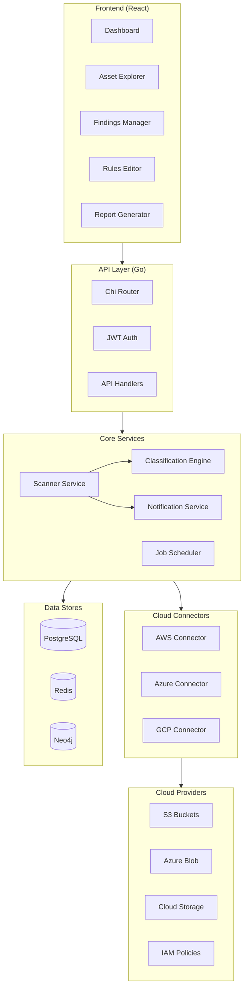

## Data Flow

The DSPM solution follows a clear data flow from discovery to remediation:

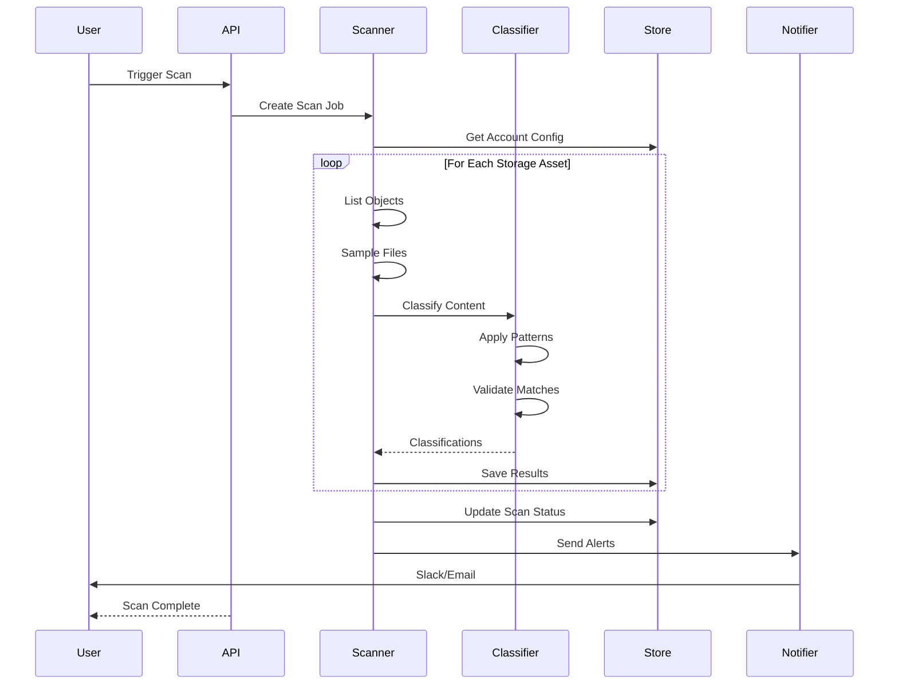

## Classification Pipeline

The classification engine is the heart of DSPM. It uses a multi-stage pipeline to accurately identify sensitive data:

```mermaid
flowchart LR
    subgraph Input
        Content[File Content]
    end

    subgraph Stage1["Stage 1: Pattern Matching"]
        Regex[Regex Patterns]
        Match[Pattern Matcher]
    end

    subgraph Stage2["Stage 2: Context Analysis"]
        Context[Context Patterns]
        Verify[Context Verification]
    end

    subgraph Stage3["Stage 3: Validation"]
        Luhn[Luhn Algorithm]
        Format[Format Validation]
        Checksum[Checksum Verification]
    end

    subgraph Output
        Result[Classification Result]
    end

    Content --> Regex
    Regex --> Match
    Match --> Context
    Context --> Verify
    Verify --> Luhn
    Luhn --> Format
    Format --> Checksum
    Checksum --> Result
```

### Classification Categories

We classify data into four main categories:

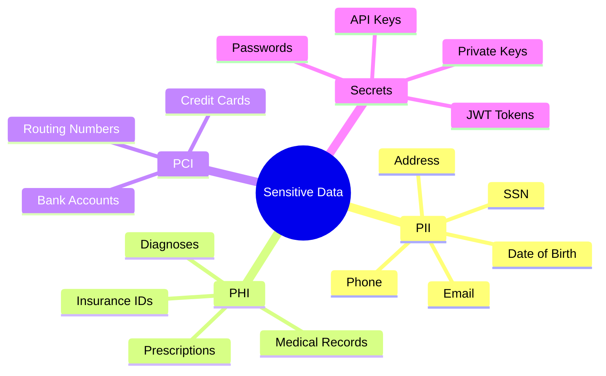

## Access Graph Analysis

Understanding who can access sensitive data requires analyzing IAM policies. We use Neo4j to model access relationships:

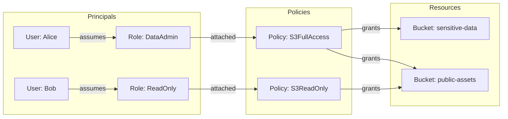

This graph structure allows us to answer queries like:
- "Who can access bucket X?"
- "What resources can user Y access?"
- "Is there any public access to sensitive data?"

## Scan Scheduling

The scheduler uses cron expressions to automate scans:

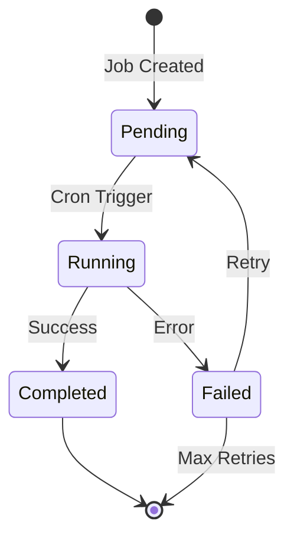

### Job Types

| Job Type | Description | Typical Schedule |
|----------|-------------|------------------|
| `scan_account` | Scan specific account | `0 */6 * * *` (every 6h) |
| `scan_all_accounts` | Full scan all accounts | `0 2 * * *` (daily 2am) |
| `sync_access_graph` | Update IAM graph | `0 3 * * 0` (weekly) |
| `cleanup_old` | Remove old data | `0 4 1 * *` (monthly) |
| `generate_report` | Scheduled reports | `0 8 * * 1` (weekly Mon) |

## Notification Flow

When critical findings are detected, notifications are sent through multiple channels:

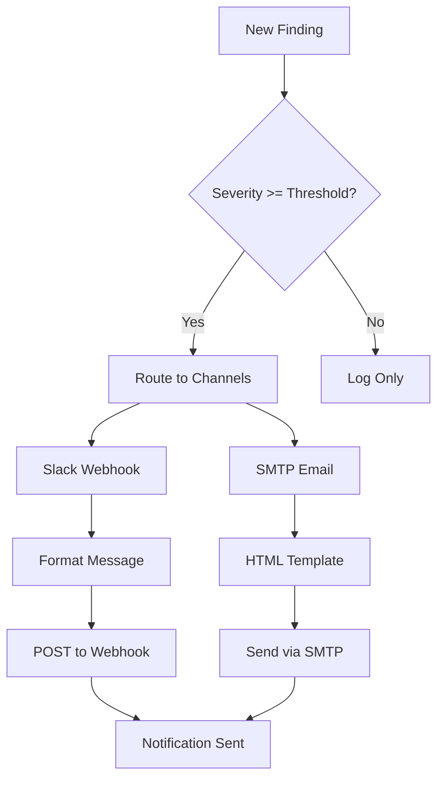

### Slack Message Format

```json
{
  "attachments": [{
    "color": "#FF0000",
    "title": "CRITICAL Security Finding",
    "text": "Credit card numbers detected in s3://sensitive-bucket/data.csv",
    "fields": [
      {"title": "Severity", "value": "Critical", "short": true},
      {"title": "Category", "value": "PCI", "short": true},
      {"title": "Asset", "value": "s3://sensitive-bucket", "short": false}
    ],
    "footer": "DSPM Alert System"
  }]
}
```

## Report Generation

The reporting system supports multiple formats and report types:

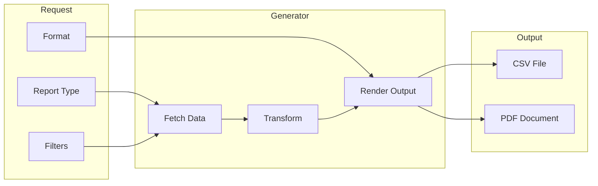

### Report Types

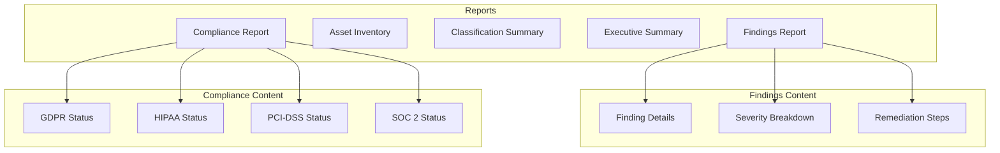

## Database Schema

The PostgreSQL schema captures the full data model:

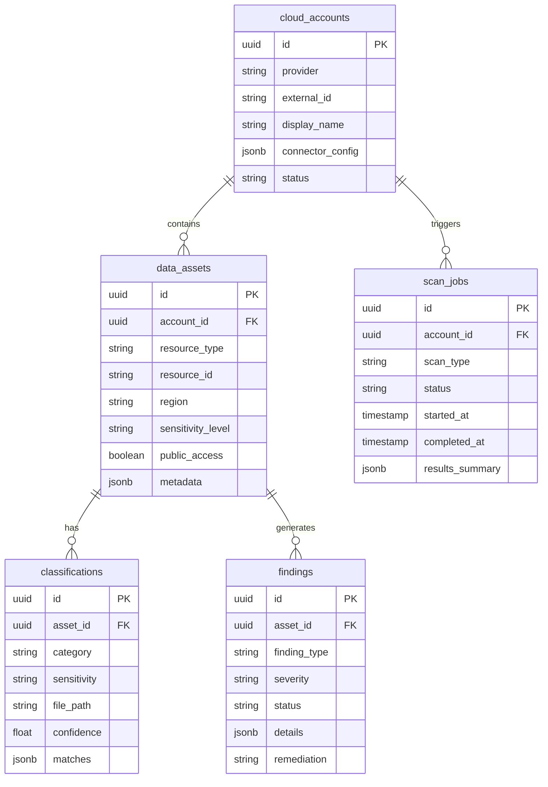

## Custom Rules Engine

The rules engine allows security teams to define custom classification patterns:

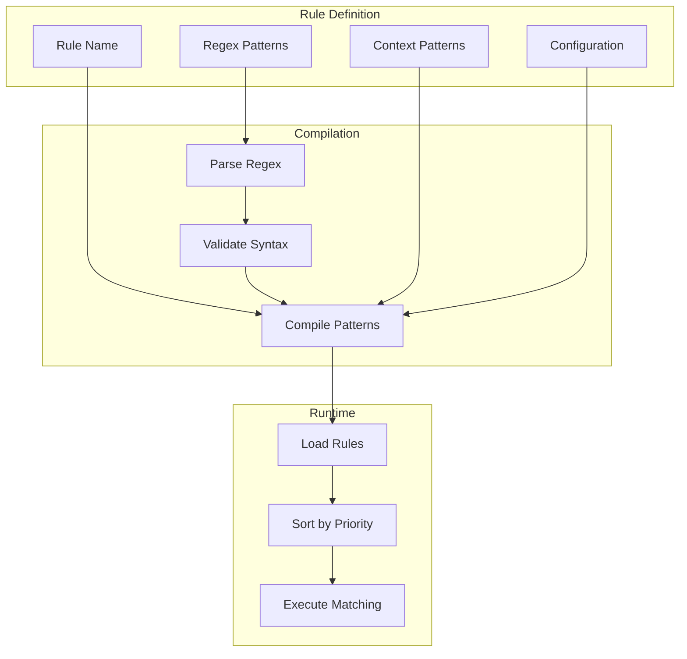

### Rule Example

```yaml
name: "Employee ID Pattern"
description: "Detects internal employee IDs"
category: "pii"
sensitivity: "medium"
patterns:
  - "\\bEMP-\\d{6}\\b"
  - "\\bEID:\\s*\\d{6}\\b"
context_patterns:
  - "(?i)employee|staff|personnel"
context_required: true
priority: 75
enabled: true
```

## Security Architecture

The API is secured with JWT authentication and role-based access control:

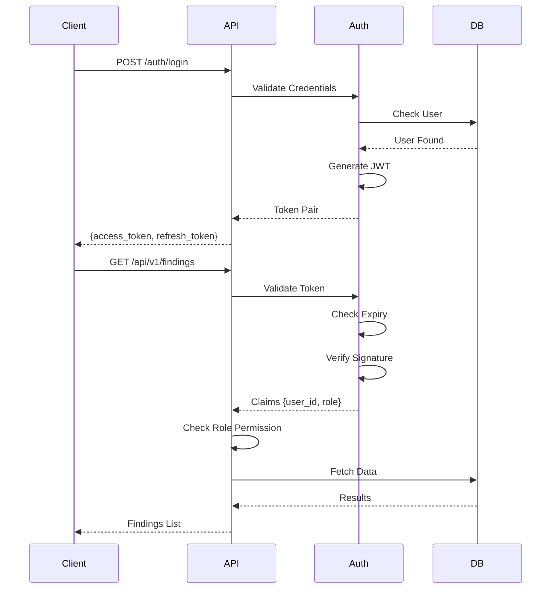

### Role Hierarchy

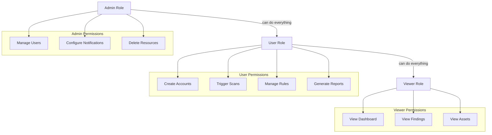

## Deployment Architecture

For production deployments, we recommend a containerized architecture:

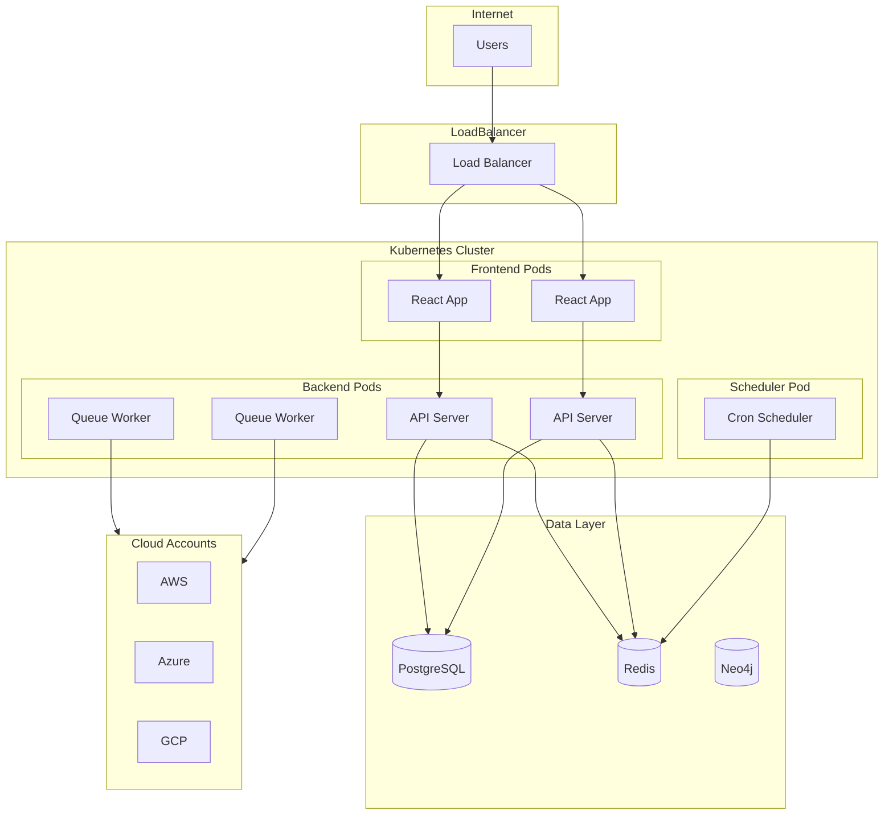

## Performance Considerations

### Sampling Strategy

For large buckets with millions of objects, we use intelligent sampling:

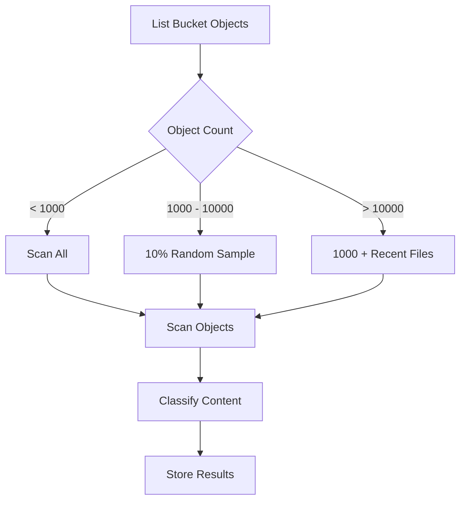

### Parallel Processing

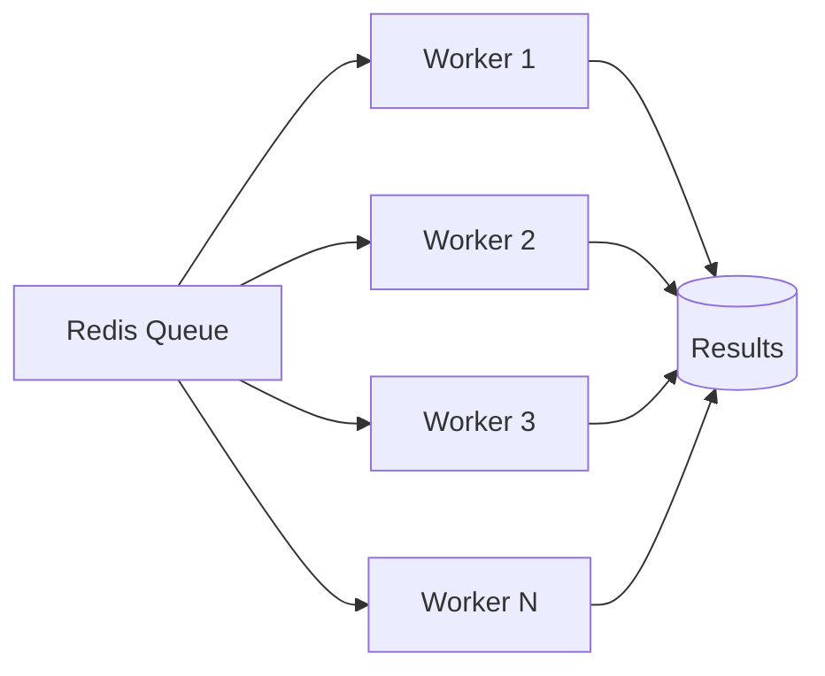

## Conclusion

Building a DSPM solution requires careful consideration of:

1. **Scalability** - Cloud environments can have millions of objects
2. **Accuracy** - Classification must minimize false positives
3. **Performance** - Scanning should not impact production workloads
4. **Security** - The DSPM itself must be secure
5. **Compliance** - Reports must meet regulatory requirements

This architecture provides a solid foundation for discovering, classifying, and protecting sensitive data across multi-cloud environments.

## Next Steps

To extend this solution, consider adding:

- **Machine Learning Classification** - Use ML models for better accuracy
- **Data Lineage** - Track data flow between systems
- **Risk Scoring** - Quantify risk based on sensitivity and exposure
- **Auto-Remediation** - Automatically fix common issues
- **SIEM Integration** - Feed findings to security operations

---

*Built with Go, React, PostgreSQL, Redis, and Neo4j*
